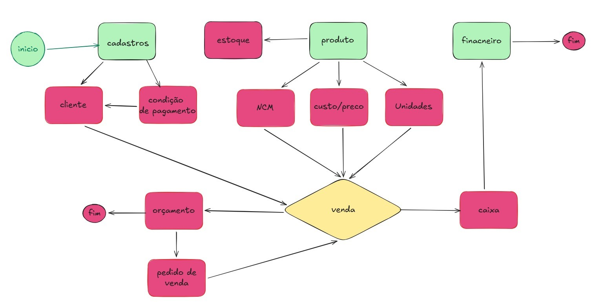

# projeto_delphi_vendas

## 📌 Descrição do Projeto

O **projeto_delphi_vendas** tem como objetivo o desenvolvimento de uma aplicação desktop em **Delphi**, voltada para a gestão de vendas, permitindo:

* Cadastro de pessoas (clientes e/ou vendedores)
* Cadastro de produtos
* Realização de vendas
* Emissão de relatórios

O projeto adota uma arquitetura organizada, inspirada em **DDD (Domain-Driven Design)**, visando facilitar a manutenção, escalabilidade e entendimento do código.

---

## 🛠️ Tecnologias Utilizadas

* **Delphi** (RAD Studio 12)
* **Oracle** (banco de dados)
* **Zeus** (tecnologia de conexão com banco de dados)
* **Git** (controle de versão)

---

## 📂 Estrutura de Pastas

Abaixo está a estrutura principal do projeto:

```
/src
├── domain
│   ├── entities
│   ├── valueobjects
│   └── interfaces
│
├── services
│
├── infrastructure
│   ├── database
│   └── repositories
│
├── view
│   └── forms
│
├── shared
│   └── utils
│
└── main
```

---

## 📁 Detalhamento das Camadas

### 🔹 domain

Camada responsável pelas **regras de negócio puras** do sistema.

* **entities**: classes que representam o negócio (Pessoa, Produto, Venda, Categoria, etc.)
* **valueobjects**: objetos de valor e tipos auxiliares (Status, TipoPessoa, etc.)
* **interfaces**: contratos que definem operações, como repositórios

> 📌 Esta camada não deve conter código de banco de dados, componentes visuais ou dependências externas.

---

### 🔹 application

Responsável pelos **casos de uso** e pelo fluxo da aplicação.

* **services**: serviços que coordenam as ações do sistema, aplicando regras de negócio e chamando os repositórios

---

### 🔹 infrastructure

Camada que implementa os detalhes técnicos.

* **database**: DataModules, conexões e configurações de acesso ao banco de dados
* **repositories**: implementação concreta das interfaces definidas no domínio, incluindo SQL e acesso ao banco

---

### 🔹 presentation

Camada de **interface com o usuário**.

* **forms**: formulários Delphi responsáveis pela interação com o usuário (cadastros, vendas, relatórios)

> 📌 Os forms devem apenas capturar dados, exibir informações e chamar os serviços da camada application.

---

### 🔹 shared

Código reutilizável em todo o projeto.

* **utils**: funções utilitárias, mensagens, validações genéricas e helpers

---

### 🔹 main

Ponto de entrada da aplicação.

* Inicialização do sistema
* Criação de DataModules
* Configurações globais

---

## 🚀 Benefícios da Arquitetura

* Código mais organizado e legível
* Facilidade de manutenção
* Separação clara de responsabilidades
* Base sólida para crescimento do sistema

---

## 🔄 Fluxo do Processo de Vendas

O sistema foi modelado com base em um **fluxo de negócio completo**, desde os cadastros iniciais até o fechamento financeiro da venda.

### 📌 Visão Geral do Processo

O fluxo segue a seguinte lógica:

1. **Início do sistema**
2. **Cadastros básicos**

   * Cliente
   * Condição de pagamento
3. **Cadastro de Produto**, incluindo:

   * NCM
   * Custos e preços
   * Unidades de medida
   * Controle de estoque
4. **Processo de Venda**, que centraliza:

   * Cliente
   * Produto
   * Condição de pagamento
5. A venda pode gerar:

   * **Orçamento** (com possibilidade de conversão)
   * **Pedido de venda**
6. Após a confirmação:

   * Movimentação de **Caixa**
   * Registro no módulo **Financeiro**
7. **Encerramento do processo**

---

### 🗺️ Diagrama do Fluxo de Vendas

O diagrama abaixo representa visualmente o processo de negócio adotado no sistema:



---

## 🚀 Benefícios do Modelo de Processo

* Clareza no fluxo operacional
* Separação de responsabilidades entre módulos
* Facilidade de manutenção e evolução
* Base sólida para relatórios gerenciais e financeiros

---

## 📄 Licença

Este projeto é de uso educacional e profissional, podendo ser adaptado conforme a necessidade.